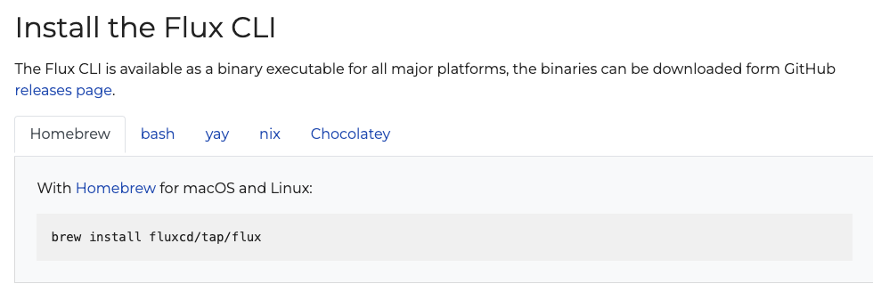

## Specifiy Git credentials
```
export GITHUB_TOKEN=<your-token>
export GITHUB_USER=<your-username>
```


## Install Flux
It's all based on the OS that you're currently on.



https://fluxcd.io/flux/installation/

## Check Flux Installation
  `flux check --pre`

## Connect To GitHub

The command below not only connects Flux to GitHub, but it creates a new repo called `flux-fleet` where you can manage all of your clusters and repos/sources from one place.

Notice on line 31 it shows the path is to Minikube. If you're not using Minikube, you can change the name to the desired cluster name. For example, if I deployed a cluster on Azure Kubernetes Service (AKS) called `aksenvironment01`, I would change the name line 31 to `aksenvironment01`, leaving the `clusters` directory as is.

```
flux bootstrap github \
  --owner=$GITHUB_USER \
  --repository=fleet-gitops \
  --branch=main \
  --namespace=fluxname \
  --path=./clusters/minikube \
  --personal
  ```

  Open up the `flux-fleet` repository and you'll see the configuration that make Flux know to deploy containerized applications to a particular cluster. In this case, it's the cluster you're running locally.

## Flux-fleet repo

You're going to need to perform your flux commands from the `flux-fleet` repository. The reason why is because the `flux-fleet` repo is where the configuration for your clusters Flux config exists.

1. Clone the `flux-fleet` from the GitHub repository to your `localhost`
2. `cd` into the `flux-fleet` repo

You're now ready to deploy your containerized application with GitOps.

## Add the repo/source to Flux
In the example below, you're creating a source for where the containerized applications Kubernetes Manifest will exist and the interval check-in. As discussed, the interview check-in is how many times the GitOps Controller looks at the Git repo where the Kubernetes Manifest exists to see if any changes were made.

```
flux create source git nginxdeployment \
  --url=https://github.com/adminturneddevops/PearsonCourses \
  --branch=main \
  --interval=30s \
  --namespace=fluxname \
  --export > ./clusters/minikube/nginxdeployment-source.yaml
```

The output will look like the below.

```
apiVersion: source.toolkit.fluxcd.io/v1beta2
kind: GitRepository
metadata:
  name: nginxdeployment
  namespace: fluxname
spec:
  interval: 30s
  ref:
    branch: main
  url: https://github.com/adminturneddevops/PearsonCourses
```

Push the changes to the repo.

```
git add -A && git commit -m "Add nginxdeployment GitRepository"
git push
```

## Deploy the app
```
flux create kustomization nginxdeployment \
  --target-namespace=default \
  --source=nginxdeployment \
  --path="./kustomize" \
  --prune=true \
  --namespace=fluxname \
  --interval=5m \
  --export > ./clusters/minikube/nginxdeployment-kustomization.yaml
  ```

  ```
git add -A && git commit -m "Add nginxdeployment Kustomization"
git push
```

## Watch the release
`flux get kustomizations -n fluxname --watch`