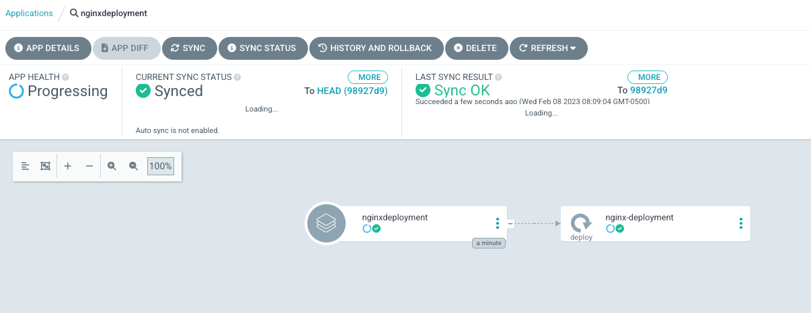

## ArgoCD CLI Installation
https://argo-cd.readthedocs.io/en/stable/cli_installation/

## Server Installation
Create namespace

```
kubectl create namespace argocd
```

Install Argo
```
kubectl apply -n argocd -f https://raw.githubusercontent.com/argoproj/argo-cd/stable/manifests/ha/install.yaml
```

OR

**If you aren't in an HA environment that has three (3) nodes (for example, if you're using Minikube)**

```
kubectl apply -n argocd -f https://raw.githubusercontent.com/argoproj/argo-cd/stable/manifests/install.yaml
```

Get the initial ArgoCD UI admin password
```
kubectl get secret -n argocd argocd-initial-admin-secret -o jsonpath="{.data.password}" | base64 -d
```

Open up Argo's UI by using Port Forwarding on the ArgoCD service

```
kubectl port-forward -n argocd service/argocd-server :80
```

Log into the UI:

- Username is admin
- Password is the output of the command above: `kubectl get secret -n argocd argocd-initial-admin-secret -o jsonpath="{.data.password}" | base64 -d`

## Logging Into Argo
Log into the server via the CLI. The port is what ArgoCD is hosting hosted on from the `kubectl port-forward` section in **Server Installation**
`argocd login 127.0.0.1:argocd_port_here`

- Username is admin
- Password is the output of the command above: `kubectl get secret -n argocd argocd-initial-admin-secret -o jsonpath="{.data.password}" | base64 -d`

## Registering A Cluster
**IF THIS STEP DOESN'T WORK**
If you're using Minikube, or another cluster, and you're trying to register the cluster that you installed ArgoCD on, it will most likely fail because ArgoCD is already running on the cluster. If it does fail, no problem. It's still good to see and understand the workflow for when you're registering Kubernetes clusters to ArgoCD in the real world.

Get your current context for your k8s cluster

`kubectl config get-contexts -o name`

Add the context
`argocd cluster add kubernetes_context_name_here`

## App Deployment
The last step is to deploy an app. The app that you'll be deploying is an Nginx containerized app, which you can see if you go to the path in the `--repo` flag below.

If you have another containerized app that you'd like to try to deploy, feel free. However, we cannot troubleshoot any apps that we did not create.

`argocd app create nginxdeployment --repo https://github.com/AdminTurnedDevOps/kubernetes-examples.git --path imagePullPolicy --dest-server https://kubernetes.default.svc --dest-namespace default`

You should now see the app running in the Argo UI

