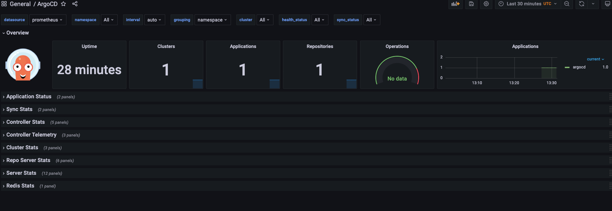

10 minutes

**If the `kube-prometheus` directory is empty for you, please re-clone it here**: https://prometheus-operator.dev/docs/prologue/quick-start/

Clone the `kube-prometheus` repo

```
git clone https://github.com/prometheus-operator/kube-prometheus.git
```

CD into the `kube-prometheus` repo

Run the following:

```
helm repo add prometheus-community https://prometheus-community.github.io/helm-charts

helm repo update

helm install kubeprometheus prometheus-community/kube-prometheus-stack
```

The next installation, which is the `metricsconsumption.yaml` configures Prometheus to listen to the `/metrics` endpoint from ArgoCD. The Argo Rollouts controller is already instrumented with Prometheus metrics available at /metrics in port 8082. You can use these metrics to look at the health of the controller either via dashboards or via other Prometheus integrations.

```
cd .. && kubectl apply -f metricsconsumption.yaml
```

Forward the port of the UI so you can log into Prometheus and see the Metrics.

```
kubectl --namespace monitoring port-forward svc/prometheus-k8s 9090
```

Forward the port of the Grafana UI so you can log in and see the graphs


```
kubectl --namespace monitoring port-forward svc/grafana 3000
```

To log into Grafana:
1. Username: admin
2. Password: admin

Within Grafana, import the example ArgoCD dashboard in. It's in the same directory as this `handson.md` file and it's called `argo.json`

Do so by going to Dashboard --> Browse --> Import (the blue Import button) --> Point to the `argo.json` file.

You can now see the cluster and apps deployed.



For more info, check out the following: https://prometheus-operator.dev/docs/prologue/quick-start/