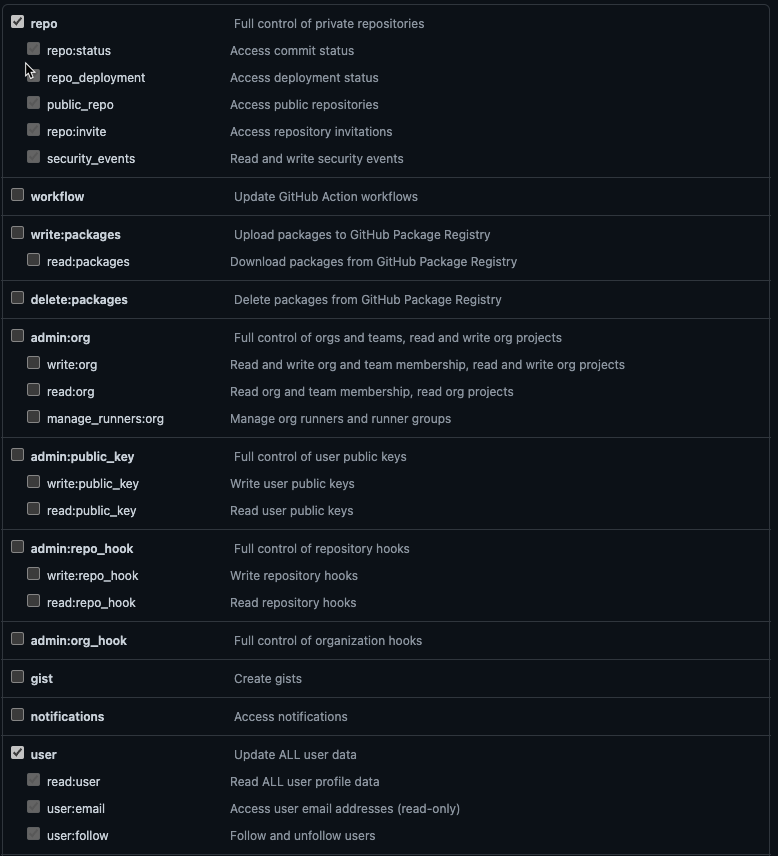
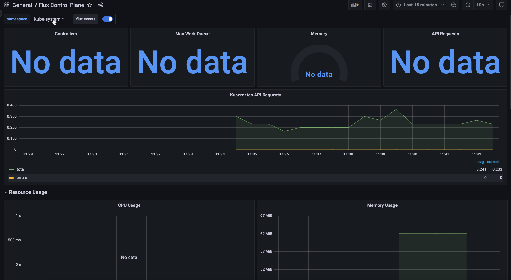

A lot of the steps below will look like the steps you went through in Section 3.

They're very similar. The difference is the application you're installing for the dashboard.

## Specifiy Git credentials

```
export GITHUB_TOKEN=
export GITHUB_USER=
```



## Check Flux Installation
  ```
  flux check --pre
  ```

## Connect To GitHub

The command below not only connects Flux to GitHub, but it creates a new repo called `flux-fleet` where you can manage all of your clusters and repos/sources from one place.

```
flux bootstrap github \
  --owner=$GITHUB_USER \
  --repository=fleet-gitops \
  --branch=main \
  --namespace=fluxname \
  --path=./clusters/minikube \
  --personal
  ```

## Flux-fleet repo

You're going to need to perform your flux commands from the `flux-fleet` repository.

1. Clone the `flux-fleet` repository to your `localhost`
2. `cd` into the `flux-fleet` repo

## Add the repo/source to Flux
```
flux create source git flux-monitoring \
  --interval=30m \
  --namespace=fluxname \
  --url=https://github.com/fluxcd/flux2 \
  --branch=main
```

## Deploy the app
```
flux create kustomization kube-prometheus-stack \
  --interval=1h \
  --prune \
  --source=flux-monitoring \
  --namespace=fluxname \
  --path="./manifests/monitoring/kube-prometheus-stack" \
  --health-check-timeout=5m \
  --wait
  ```

Wait around 3-5 minutes after the app is deployed

## Install Flux Dashboard
```
flux create kustomization monitoring-config \
  --depends-on=kube-prometheus-stack \
  --interval=1h \
  --prune=true \
  --source=flux-monitoring \
  --namespace=fluxname \
  --path="./manifests/monitoring/monitoring-config" \
  --health-check-timeout=1m \
  --wait
```

## Port Forward
```
kubectl -n monitoring port-forward svc/kube-prometheus-stack-grafana 3000:80
```

Access the dashboard: http://localhost:3000/d/flux-control-plane/flux-control-plane

Credentials:
1. Username: admin
2. Password: prom-operator

When logging in, you should see a view similar to the screenshot below.

