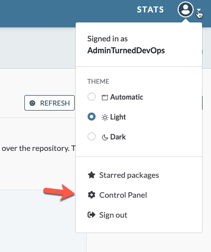

1. Sign up for Artifact Hub [here](https://artifacthub.io/)
2. Once signed in, click on your profile and go to Control Panel

3. Go to the Repository tab and click on *ADD REPOSITORY*
4. Add in the following information:
- The name of your Helm Chart
- The GitHub path to the Helm Chart

If you don't already have a Helm Chart in GitHub, take one of the examples that you created in this training and push it to GitHub

5. Click the Add button

You should now be able to search for your GitHub repo