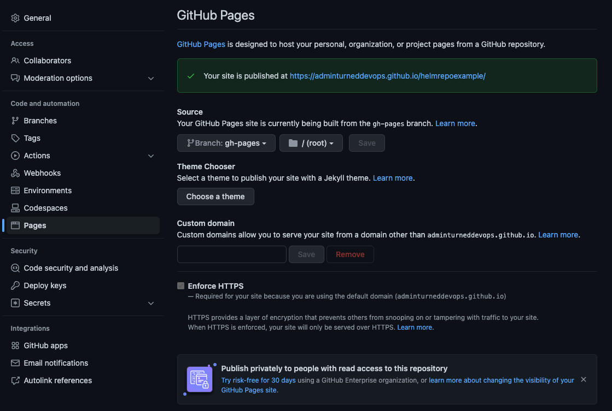

1. Create a GitHub repo or use the one from the previous lab with Artifact Hub
2. Create a new branch for the repo called `gh-pages`
3. On your repo, go to *Settings* --> *Code and Automation* --> *Pages*

You'll see that your repo is set up as a GitHub Page and there's a specific URL for it up top

By default Source usually gets set to gh-pages branch. If this is not set by default, then select it.

You can use a custom domain there if you wish so.

And check that Enforce HTTPS is ticked, so the HTTPS will be used when charts are served.

In such setup you can use your default branch to store your charts code, and gh-pages branch as charts repository, e.g.: https://USERNAME.github.io/REPONAME. The demonstration TS Charts repository is accessible at https://technosophos.github.io/tscharts/.

If you have decided to use GitHub pages to host the chart repository, check out Chart Releaser Action. Chart Releaser Action is a GitHub Action workflow to turn a GitHub project into a self-hosted Helm chart repo, using helm/chart-releaser CLI tool.